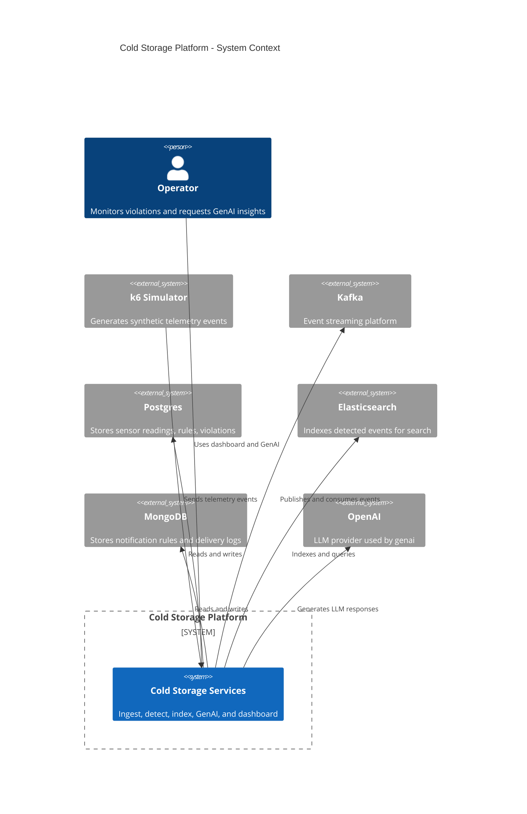
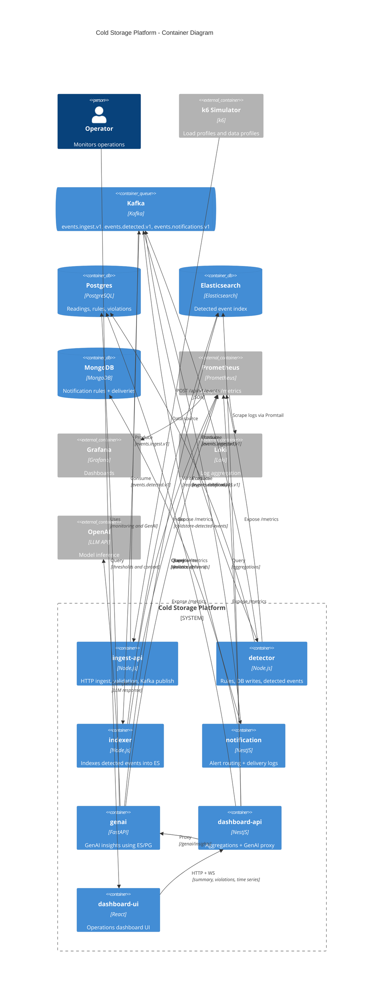

# Cold Storage Architecture (C4)

This file provides C4-style diagrams in Mermaid. Use a Markdown viewer that
supports Mermaid C4 (e.g., Mermaid 10+ or compatible VS Code extensions).

## C4 Context

## C4 Container

